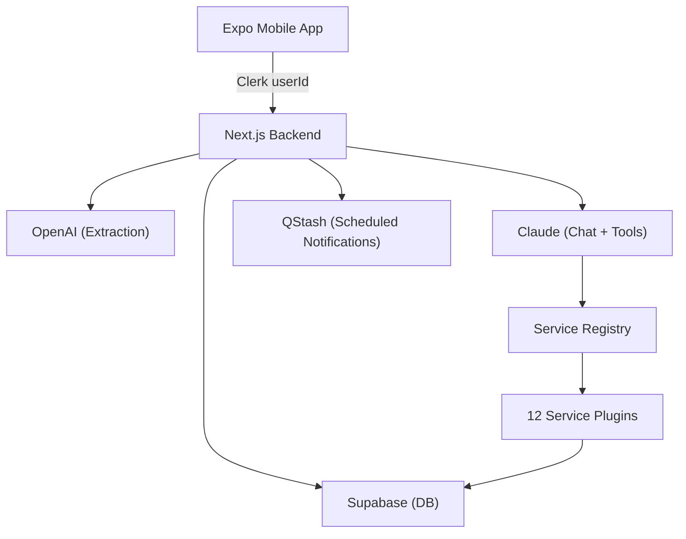

# Loop Backend — API Documentation

> **Base URL**: `https://loop-backend-pearl.vercel.app` (production) or `http://localhost:3000` (dev)
>
> **Auth**: All endpoints require a Clerk `userId` passed as a query param or in the request body. The Expo app should use `@clerk/clerk-expo` to get the user ID.

---

## Quick Reference

| Method | Endpoint | Purpose |
|--------|----------|---------|
| `POST` | `/api/users/sync` | Sync user profile after sign-up/sign-in |
| `POST` | `/api/capture` | Capture user input → extract memories |
| `GET` | `/api/memories?userId=` | List all memory items |
| `GET` | `/api/daily-brief?userId=` | Get priority items due within 24h |
| `GET` | `/api/assistant?userId=` | AI task analysis + proposed actions |
| `POST` | `/api/chat` | Chat with AI agent (tool use) |
| `POST` | `/api/execute` | Execute an approved action |
| `POST` | `/api/draft` | Generate a draft message |
| `POST` | `/api/close` | Close a memory item |
| `GET` | `/api/notifications?userId=` | Fetch notification history |
| `POST` | `/api/register-device` | Register Expo push token |
| `GET` | `/api/credentials/status?userId=` | List connected & available integrations |
| `POST` | `/api/credentials/connect` | Connect a service (store credentials) |
| `POST` | `/api/credentials/disconnect` | Disconnect a service |
| `GET` | `/api/github/repos?userId=` | List user's GitHub repos |
| `GET` | `/api/linear/context?userId=` | Get Linear workspace context |
| `POST` | `/api/delete-account` | Permanently delete user account |

---

## Architecture



---

## 1. User Management

### `POST /api/users/sync`

Sync user profile from Clerk to Supabase. **Call this on every app launch after auth.**

```json
// Request
{
  "userId": "clerk_user_id",
  "email": "user@example.com",
  "fullName": "John Doe",         // optional
  "avatarUrl": "https://..."      // optional
}

// Response (200)
{ "success": true }
```

---

### `POST /api/delete-account`

Permanently delete a user and all their data (cascades to memory items, credentials, etc).

```json
// Request
{ "userId": "clerk_user_id" }

// Response (200)
{ "success": true }
```

---

## 2. Memory (Capture & Retrieve)

### `POST /api/capture`

Capture free-form user input. The backend uses OpenAI to extract structured tasks/notes automatically.

```json
// Request
{
  "userId": "clerk_user_id",
  "text": "Remind me to review the PR tomorrow at 3pm",
  "timezone": "Asia/Kolkata"
}

// Response (200)
{
  "agentMessage": "Got it. I'll keep track of this."
}
```

> **What happens behind the scenes:**
> - LLM extracts type (`task`/`follow_up`/`note`), title, urgency, due date
> - Creates `memory_items` row in Supabase
> - If there's a future due date → schedules a push notification via QStash

---

### `GET /api/memories?userId=`

Fetch all memory items for the user.

```json
// Response (200)
{
  "items": [
    {
      "id": "uuid",
      "user_id": "clerk_user_id",
      "type": "task",           // "task" | "follow_up" | "note"
      "title": "Review the PR",
      "context": "Additional context...",
      "source_text": "Original user input",
      "due_at": "2026-02-20T09:30:00Z",  // ISO 8601 or null
      "urgency": "high",       // "low" | "medium" | "high"
      "status": "open",        // "open" | "nudged" | "closed" | "ignored"
      "scheduled_message_id": "qstash_msg_id",
      "created_at": "2026-02-19T..."
    }
  ]
}
```

---

### `POST /api/close`

Close (complete) a memory item.

```json
// Request
{ "memoryItemId": "uuid" }

// Response (200)
{ "success": true }
```

---

## 3. AI Assistant

### `GET /api/daily-brief?userId=`

Get items due within the next 24 hours, ordered by urgency + due date. **No LLM call** — pure database query.

```json
// Response (200)
{
  "items": [
    {
      "id": "uuid",
      "title": "Review the PR",
      "type": "task",
      "urgency": "high",
      "dueAt": "2026-02-20T09:30:00Z"
    }
  ]
}
```

---

### `GET /api/assistant?userId=`

Full AI-powered task analysis. Uses OpenAI to prioritize tasks and propose actions (GitHub issues, Linear tickets, Gmail drafts).

```json
// Response (200)
{
  "message": "Hey! You have 2 tasks that need attention today...",
  "priority_tasks": [
    {
      "id": "uuid",
      "title": "Review the PR",
      "reason": "Due today, high urgency",
      "suggested_steps": ["Open the PR", "Check the diff", "Leave comments"]
    }
  ],
  "proposed_actions": [
    {
      "type": "create_github_issue",
      "requires_approval": true,
      "payload": {
        "repo": "owner/repo",
        "title": "[Bug] Fix login timeout",
        "body": "## Problem\n..."
      }
    }
  ]
}
```

**Action types**: `create_github_issue`, `draft_pr_description`, `create_linear_issue`, `draft_gmail_reply`

---

### `POST /api/chat`

Chat with the Claude-powered AI agent. This is the **primary conversational endpoint**. Claude can use tools from any connected service automatically.

```json
// Request
{
  "userId": "clerk_user_id",
  "message": "Create a Jira ticket for the login bug",
  "timezone": "Asia/Kolkata"
}

// Response (200)
{
  "reply": "I've created a Jira ticket for the login bug. Here's what I set up...",
  "captured_item": {
    "type": "task",
    "title": "Fix login bug",
    "context": "...",
    "due_at": null,
    "urgency": "high"
  },
  "proposed_actions": [],
  "tool_results": [
    {
      "tool": "jira_create_issue",
      "success": true,
      "data": { "key": "PROJ-123", "url": "https://..." },
      "displayMessage": "Created Jira issue PROJ-123"
    }
  ]
}
```

> **How tool use works:**
> - Claude receives tools **only for services the user has connected**
> - If the user says "create a Jira ticket" but hasn't connected Jira, Claude will tell them to connect it first
> - Tools execute in real-time during the chat conversation

---

### `POST /api/execute`

Execute a proposed action that the user has approved (from `/api/assistant` or `/api/chat`).

```json
// Request
{
  "userId": "clerk_user_id",
  "action": {
    "type": "create_github_issue",
    "payload": {
      "repo": "owner/repo",
      "title": "Fix login bug",
      "body": "## Problem\n..."
    }
  },
  "memoryItemId": "uuid"  // optional — links result back to memory item
}

// Response (200)
{
  "success": true,
  "result": { "url": "https://github.com/..." },
  "successMessage": "Created GitHub issue #42"
}

// Response (403) — service not connected
{
  "error": "github is not connected. Please connect it in Settings > Integrations first."
}
```

---

### `POST /api/draft`

Generate a draft message for a memory item using AI.

```json
// Request
{
  "userId": "clerk_user_id",
  "memoryItemId": "uuid",
  "tone": "professional"    // "polite" | "professional" | "firm"
}

// Response (200)
{
  "draftText": "Hi Team,\n\nI wanted to follow up on..."
}
```

---

## 4. Notifications

### `GET /api/notifications?userId=`

Fetch all notification records (scheduled, sent, failed).

```json
// Response (200)
{
  "notifications": [
    {
      "id": "uuid",
      "user_id": "clerk_user_id",
      "memory_item_id": "uuid",
      "title": "Reminder",
      "body": "Time to review the PR",
      "scheduled_at": "2026-02-20T09:30:00Z",
      "status": "sent",        // "scheduled" | "sent" | "failed"
      "scheduled_message_id": "qstash_msg_id",
      "created_at": "2026-02-19T..."
    }
  ]
}
```

---

### `POST /api/register-device`

Register an Expo push token for receiving push notifications, **Call this at app launch after getting the token from `expo-notifications`.**

```json
// Request
{
  "userId": "clerk_user_id",
  "pushToken": "ExponentPushToken[xxxxxxx]",
  "platform": "ios",          // "ios" | "android"
  "deviceToken": "apns_token" // optional, raw device token
}

// Response (200)
{ "success": true }
```

---

## 5. Integrations (Service Credentials)

### `GET /api/credentials/status?userId=`

Get which services the user has connected and which are available to connect.

```json
// Response (200)
{
  "connected": [
    {
      "service": "github",
      "metadata": { "username": "john" },
      "connected_at": "2026-02-19T..."
    }
  ],
  "available": [
    {
      "name": "jira",
      "displayName": "Jira",
      "description": "Project tracking and issue management",
      "credentialFields": [
        {
          "key": "domain",
          "label": "Jira Domain",
          "type": "text",
          "required": true,
          "placeholder": "yourcompany.atlassian.net"
        },
        {
          "key": "email",
          "label": "Email",
          "type": "text",
          "required": true
        },
        {
          "key": "api_token",
          "label": "API Token",
          "type": "password",
          "required": true,
          "helpUrl": "https://id.atlassian.com/manage-profile/security/api-tokens"
        }
      ]
    }
  ]
}
```

---

### `POST /api/credentials/connect`

Store encrypted credentials for a service.

```json
// Request
{
  "userId": "clerk_user_id",
  "service": "github",
  "credentials": {
    "token": "ghp_xxxxxxxxxxxx"
  },
  "metadata": {                // optional
    "username": "john"
  }
}

// Response (200)
{ "message": "github connected successfully" }
```

---

### `POST /api/credentials/disconnect`

Remove stored credentials for a service.

```json
// Request
{
  "userId": "clerk_user_id",
  "service": "github"
}

// Response (200)
{ "message": "github disconnected" }
```

---

## 6. Service-Specific Endpoints

### `GET /api/github/repos?userId=`

Fetch the user's GitHub repositories (requires GitHub to be connected).

```json
// Response (200)
[
  { "name": "my-repo", "full_name": "user/my-repo", "html_url": "https://..." }
]

// Response (403) — not connected
{ "error": "GitHub is not connected. Please connect it in Settings > Integrations." }
```

---

### `GET /api/linear/context?userId=`

Fetch Linear workspace context — teams, projects, states (requires Linear to be connected).

```json
// Response (200)
{
  "teams": [...],
  "projects": [...],
  "states": [...]
}

// Response (403) — not connected
{ "error": "Linear is not connected. Please connect it in Settings > Integrations." }
```

---

## 7. Available Services (12 total)

Each service becomes available as tools in the `/api/chat` endpoint once connected.

| Service | Tools | Credential Fields |
|---------|-------|-------------------|
| **GitHub** | `create_issue`, `list_repos`, `draft_pr` | `token` (PAT) |
| **Linear** | `create_issue`, `get_context` | `api_key` |
| **Gmail** | `create_draft`, `list_recent` | `access_token`, `refresh_token`, `client_id`, `client_secret` |
| **Slack** | `send_message`, `list_channels` | `bot_token` |
| **Notion** | `create_page`, `search`, `list_databases`, `add_database_entry` | `token` |
| **Jira** | `create_issue`, `search`, `list_projects`, `add_comment` | `domain`, `email`, `api_token` |
| **Google Calendar** | `create_event`, `list_events`, `find_free_slots` | `access_token`, `refresh_token`, `client_id`, `client_secret` |
| **Trello** | `create_card`, `list_boards`, `list_cards`, `move_card`, `get_board_lists` | `api_key`, `token` |
| **Asana** | `create_task`, `list_projects`, `search_tasks`, `add_comment`, `complete_task` | `token` |
| **Todoist** | `create_task`, `list_tasks`, `complete_task`, `list_projects`, `create_project` | `api_token` |
| **Confluence** | `create_page`, `search`, `list_spaces`, `get_page` | `domain`, `email`, `api_token` |
| **Discord** | `send_message`, `list_servers`, `list_channels`, `create_thread` | `bot_token` |

---

## Expo Integration Checklist

### 1. Auth — Clerk
```bash
npx expo install @clerk/clerk-expo expo-secure-store
```
- Use `useUser()` hook to get `user.id` for all API calls
- Call `POST /api/users/sync` on sign-in

### 2. Push Notifications
```bash
npx expo install expo-notifications expo-device expo-constants
```
- Get push token via `Notifications.getExpoPushTokenAsync()`
- Call `POST /api/register-device` with the token on launch
- Handle incoming notifications with `Notifications.addNotificationReceivedListener()`

### 3. Core Screens → API Mapping

| Expo Screen | Primary Endpoint(s) |
|-------------|---------------------|
| **Home** | `GET /api/daily-brief`, `GET /api/assistant` |
| **Capture** | `POST /api/capture` |
| **Chat** | `POST /api/chat` |
| **Memories** | `GET /api/memories`, `POST /api/close` |
| **Notifications** | `GET /api/notifications` |
| **Integrations** | `GET /api/credentials/status`, `POST /api/credentials/connect`, `POST /api/credentials/disconnect` |
| **Settings** | `POST /api/delete-account` |

### 4. API Helper (Example)

```typescript
// services/api.ts
const BASE_URL = process.env.EXPO_PUBLIC_API_URL;

export async function apiGet<T>(path: string, userId: string): Promise<T> {
  const res = await fetch(`${BASE_URL}${path}?userId=${userId}`);
  if (!res.ok) {
    const err = await res.json();
    throw new Error(err.error || "Request failed");
  }
  return res.json();
}

export async function apiPost<T>(path: string, body: object): Promise<T> {
  const res = await fetch(`${BASE_URL}${path}`, {
    method: "POST",
    headers: { "Content-Type": "application/json" },
    body: JSON.stringify(body),
  });
  if (!res.ok) {
    const err = await res.json();
    throw new Error(err.error || "Request failed");
  }
  return res.json();
}
```

### 5. Environment Variables

```bash
# .env (Expo)
EXPO_PUBLIC_API_URL=https://loop-backend-pearl.vercel.app
EXPO_PUBLIC_CLERK_PUBLISHABLE_KEY=pk_test_...
```

---

## Error Handling

All endpoints return errors in a consistent format:

```json
{ "error": "Human-readable error message" }
```

| Status | Meaning |
|--------|---------|
| `400` | Missing or invalid request parameters |
| `403` | Service not connected (credential endpoints) |
| `404` | Resource not found |
| `500` | Internal server error |
