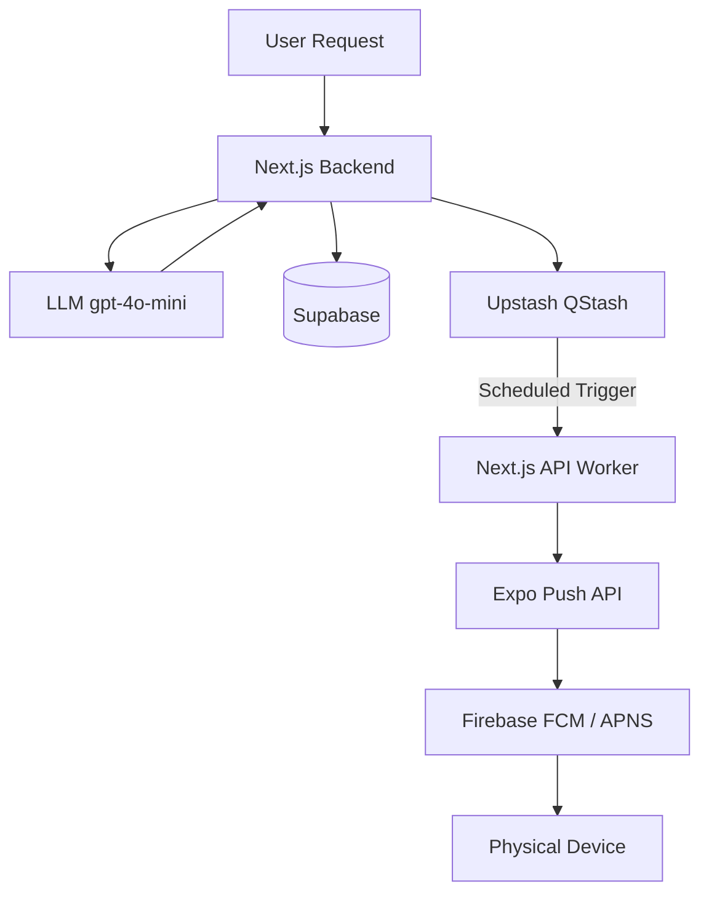

# Push Notification System Reference

This document outlines the architecture and integration flow for the push notification system used in the Loop project.

## 🏗️ Architecture

The system follows a distributed architecture to handle scheduling and delivery reliably across different platforms.

## 🚀 Components

### 1. Registration (`/api/register-device`)
- **App Side:** On launch, the app gets an `ExponentPushToken` and the native device token (FCM/APNS).
- **Backend Side:** Stores the tokens along with the platform (`android`/`ios`) and `userId` in the `device_tokens` table.
- **Auto-Cleanup:** A database-level `CASCADE` constraint ensures tokens are deleted when a user account is removed.

### 2. Intent Extraction & Scheduling
- When a user captures a task or chat message, the backend extracts a `due_at` timestamp.
- If the timestamp is in the future, the backend:
    1. Calls **GPT-4o-mini** to generate a catchy `title` and `body` for the notification.
    2. Sends a signature-verified request to **Upstash QStash** to schedule a callback.

### 3. Delivery Worker (`/api/push-worker`)
- This is a POST endpoint triggered by QStash.
- **Security:** It verifies the `upstash-signature` header to ensure requests only come from your QStash instance.
- **Logic:** It looks up the `push_token` for the user in Supabase and forwards the notification to the Expo Push API.

### 4. CLI Helper (`send-notification.ts`)
- A utility for manual testing from the terminal.
- Usage: `npx tsx send-notification.ts <userId> <title> <body>`

## 🛠️ Environment Variables Required

### Backend (`.env.local`)
| Variable | Description |
| :--- | :--- |
| `QSTASH_TOKEN` | API Token from Upstash Console |
| `QSTASH_CURRENT_SIGNING_KEY` | Signature verification key |
| `QSTASH_NEXT_SIGNING_KEY` | Backup signature verification key |
| `OPENAI_API_KEY` | For generating dynamic content |

### Frontend (`.env`)
| Variable | Description |
| :--- | :--- |
| `EXPO_PUBLIC_CLERK_PUBLISHABLE_KEY` | Clerk Authentication |

## 🧪 Testing
1. Use the CLI script to verify the basic notification pipeline.
2. Check the "Notifications" tab in the app to see scheduled items.
3. Once a task's `due_at` time passes, the notification should arrive on the physical device.
